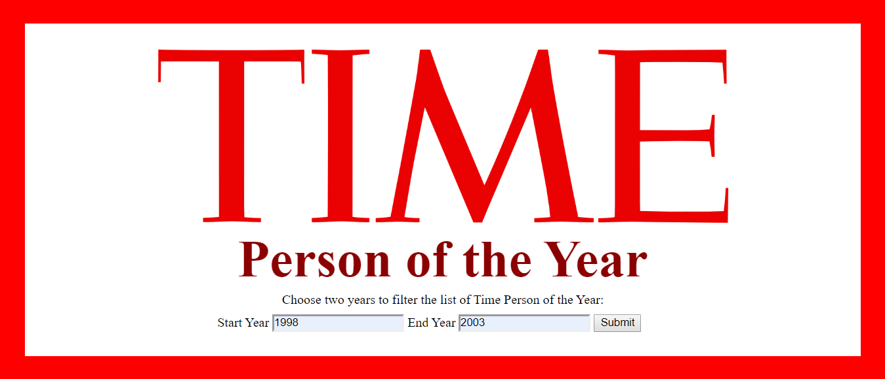
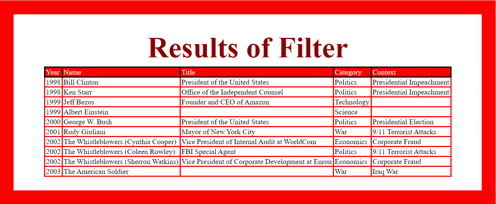

# Time Person of the Year Filter App
---
### We are deployed on Azure (soon)!

TBD

---
## Web Application

The web application consists of a frontend written in Razor views, HTML, CSS. 
The backend was written in C# using ASP.NET Core 3.0, and the MVC framework.

An app that reads a CSV file of Time People of the Year and takes in two years. The app
then displays all Persons of the Year between those two years. Data only supports years 1927 to 2016.

---

## Tools Used
Microsoft Visual Studio Community 2019 (Version 16.3.6)

- C#
- ASP.Net Core
- MVC
- Azure

---

## Recent Updates

#### V 1.0
Created intial app and functionality.

---

## Getting Started

Clone this repository to your local machine.

```
$ git clone https://github.com/cdcummings10/Lab11--MVCIntro.git
```
Once downloaded, you can either use the dotnet CLI utilities or Visual Studio 2019 (or greater) to build 
the web application. The solution file is located in the TimePersons/TimePersons 
subdirectory at the root of the repository.
```
cd Lab11--MVCIntro/TimePersons
dotnet build
```

---

## Usage

### App Start


### Results Page


---

## Change Log

1.0: Created intial app and functionality.

---

## Authors
Chris Cummings

